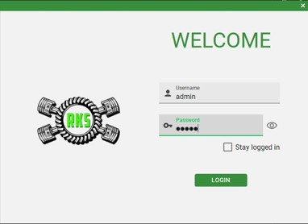
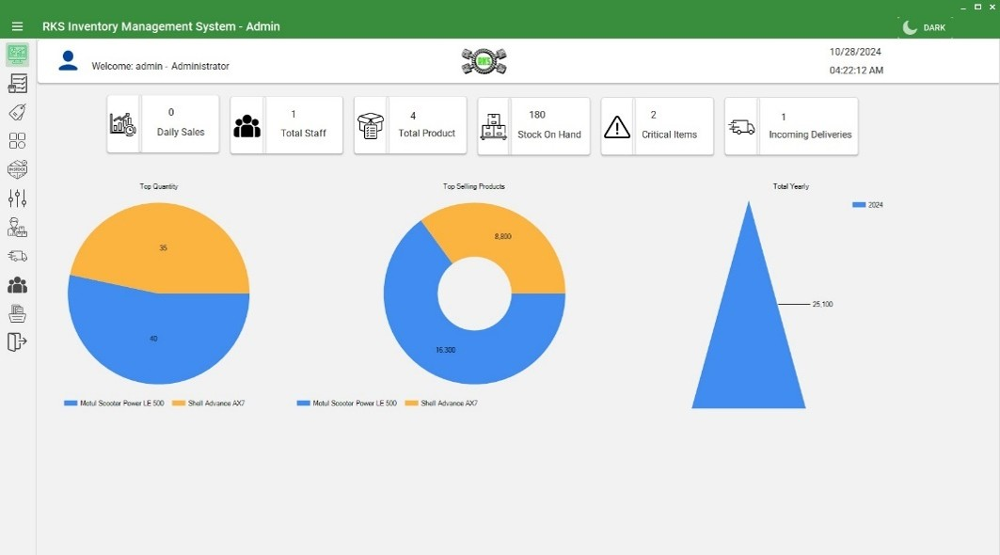

🏍️ Inventory Management System for RKS Motorcycle Parts and Accessories

Capstone Project — A desktop-based Inventory and Sales Management System developed for RKS Motorcycle Parts and Accessories.

📸 Project Screenshots

🔐 Login & Authentication

Secure login screen with role-based authentication for Admin and Staff users.

📊 Admin Dashboard

Dashboard displaying daily sales, staff count, products, stock on hand, critical items, incoming deliveries, and sales/product charts.

📦 Inventory Management

Product inventory management with product information, stock monitoring, brands, categories, and CRUD operations.

🛒 Sales & Payment Processing

Staff sales interface with product search, discounts, transaction processing, and payment handling.

📋 Stock Adjustment

Stock adjustment module for monitoring additions, removals, expired products, overstocked items, and critical stock levels.

👥 Employee & Account Management

Account and employee management with employment status tracking and role-based access.

🧾 RDLC Reports

Microsoft RDLC reports with date-range filtering, previewing, and printing.

🌙 Dark Mode

Dark mode interface designed for a more comfortable user experience.

📌 Project Overview

The Inventory Management System for RKS Motorcycle Parts and Accessories is a desktop-based application developed as a Capstone Project using C# Windows Forms and Microsoft SQL Server.

The system was designed to help manage motorcycle parts and accessories, inventory operations, sales transactions, employees, suppliers, deliveries, reports, and system activities in one centralized application.

It implements role-based access control, allowing different functionality for Administrators and Staff.

🛠️ Tech Stack
Technology	Purpose
C#	Application programming language
Windows Forms	Desktop graphical user interface
Microsoft SQL Server	Database management
Microsoft RDLC	Report generation
Visual Studio	Development environment
✨ Key Features
🔐 Authentication & Security

Secure user login

Role-based access control

Admin and Staff accounts

Parameterized SQL queries

Account management

Password change functionality

Email verification codes

System lock functionality

Activity and access logging

📦 Inventory Management

Product CRUD operations

Product management

Brand management

Category management

Stock-in management

Stock adjustment

Stock monitoring

Supplier management

Delivery management

Critical-stock monitoring

Expired-item monitoring

Overstock monitoring

Inventory additions and removals

📊 Admin Dashboard

The administrator dashboard provides an overview of important business information, including:

Daily sales

Total staff

Total products

Stock on hand

Critical inventory items

Incoming deliveries

Sales charts

Product charts

🛒 Sales & Payment Processing

Staff can process customer transactions through the sales module.

Features include:

Product search

Product selection

Quantity management

Discounts

Payment processing

Transaction processing

Sales invoices

Sales receipts

Daily sales reports

⚠️ Stock Monitoring

The system provides inventory monitoring tools to help identify:

Critical-stock products

Expired products

Overstocked products

Stock additions

Stock removals

Inventory adjustments

Critical-stock notifications help staff and administrators identify products that require attention.

👨‍💼 Employee & Account Management

The system includes employee and account management functionality:

Employee records

User account management

Admin and Staff roles

Employment status tracking

Password management

Account security

Automated Certificate of Employment generation

📑 Reports

The application uses Microsoft RDLC to generate comprehensive reports.

Available reports include:

Inventory Report

Top-Selling Products

Stock-In History

Sales History

Critical Stocks

Stock Adjustments

Cancelled Orders

Order History

Access Logs

Reports support date-range filtering and printing.

📝 Activity & Access Logging

The system records user activities and system transactions to provide better monitoring and accountability.

Logged activities include:

User access

Login activity

Inventory transactions

Sales transactions

Stock adjustments

Account activities

Other important system operations

🏗️ System Modules
Inventory Management System
│
├── 🔐 Authentication
│   ├── Login
│   ├── Password Management
│   ├── Email Verification
│   └── System Lock
│
├── 📊 Dashboard
│   ├── Daily Sales
│   ├── Product Statistics
│   ├── Staff Statistics
│   ├── Stock Statistics
│   └── Sales/Product Charts
│
├── 📦 Inventory
│   ├── Products
│   ├── Brands
│   ├── Categories
│   ├── Stock-In
│   ├── Stock Adjustment
│   ├── Suppliers
│   └── Deliveries
│
├── 🛒 Sales
│   ├── Product Search
│   ├── Discounts
│   ├── Payment Processing
│   ├── Invoices
│   └── Receipts
│
├── 👥 Accounts
│   ├── User Accounts
│   ├── Employees
│   ├── Employment Status
│   └── Certificate of Employment
│
├── 📑 Reports
│   ├── Inventory
│   ├── Sales
│   ├── Stock-In
│   ├── Critical Stocks
│   ├── Adjustments
│   ├── Orders
│   └── Access Logs
│
└── 📝 Activity Logs
    ├── Access Logs
    └── System Transactions

👤 User Roles
🔴 Administrator

The Administrator has access to system-wide management functions, including:

Dashboard

Product management

Inventory management

Stock adjustments

Suppliers

Deliveries

Employee management

Account management

Reports

Activity logs

System settings

🔵 Staff

Staff users are primarily responsible for sales and inventory-related operations assigned to them.

Staff can:

Search products

Process sales

Apply discounts

Process payments

Generate receipts

View sales information

Perform authorized inventory operations

🖼️ Suggested Screenshot Folder

Your GitHub repository can use this structure:

RKS-Inventory-Management-System/
│
├── README.md
│
├── screenshots/
│   ├── login.png
│   ├── dashboard.png
│   ├── inventory.png
│   ├── sales.png
│   ├── stock-adjustment.png
│   ├── accounts.png
│   ├── reports.png
│   └── dark-mode.png
│
└── src/
    └── ...

📷 Sample Image Placeholder

If you don't have screenshots ready yet, you can temporarily create a simple image named:

screenshots/placeholder.png

and use:

Later, simply replace placeholder.png with your real screenshot.

📸 Recommended Screenshots to Add

For a strong GitHub portfolio, I recommend adding these screenshots:

Screenshot	Suggested File
Login Screen	login.png
Admin Dashboard	dashboard.png
Product Management	inventory.png
Sales/POS	sales.png
Stock Adjustment	stock-adjustment.png
Employee Management	accounts.png
RDLC Reports	reports.png
Dark Mode	dark-mode.png

You don't need to upload every screen of the system. 6–8 high-quality screenshots are enough to showcase the project.

🔒 Security Features

The application includes several security-focused implementations:

Role-based authorization

Parameterized SQL queries

Secure account management

Password change verification

Email verification codes

System lock

Activity logging

Access logging

Parameterized SQL queries were implemented to reduce the risk of SQL injection when interacting with the database.

📈 Project Goals

The primary goals of the system were to:

Digitize inventory management

Improve stock monitoring

Reduce manual inventory work

Improve sales transaction processing

Provide accurate inventory records

Monitor critical and expired products

Improve employee/account management

Generate reliable business reports

Track system activities and transactions

🎓 Capstone Project

This project was developed as an academic Capstone Project demonstrating the application of software development concepts, database management, desktop application development, system security, reporting, and user-interface design.

Skills Demonstrated

C# Development

Windows Forms Development

SQL Server Database Design

CRUD Operations

Database Integration

Parameterized SQL Queries

Role-Based Access Control

Authentication

Inventory Management

Sales/POS Development

Report Generation

RDLC

Data Visualization

User Interface Design

System Logging

Software Testing

📄 Project Information

Project: Inventory Management System for RKS Motorcycle Parts and Accessories
Type: Capstone Project
Platform: Windows Desktop Application
Language: C#
Framework/UI: Windows Forms
Database: Microsoft SQL Server
Reporting: Microsoft RDLC
IDE: Visual Studio

⚠️ Disclaimer

This project was developed for academic/capstone purposes. The repository may not contain production deployment files, credentials, proprietary business data, or other sensitive information.

⭐ Acknowledgment

Developed as a Capstone Project for RKS Motorcycle Parts and Accessories.
